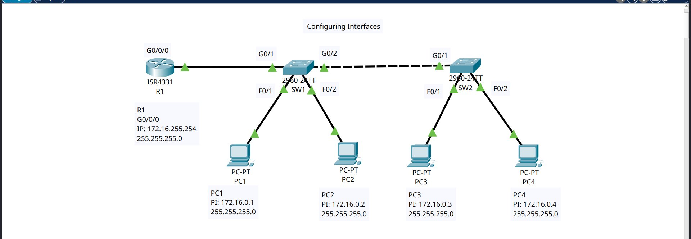

# 🖧 Cisco Packet Tracer Lab — Configuring Interfaces

> **Lab Title:** Configuring Interfaces  
> **Tool:** Cisco Packet Tracer  
> **Devices:** ISR4331 Router (R1), 2x Catalyst 2960-24TT Switches (SW1, SW2), 4x PCs  
> **Topology File:** `int conf.pkt`

---

## 📋 Objectives

- Configure IP addresses on router and PC interfaces
- Establish Layer 2 connectivity between switches
- Verify end-to-end reachability using `ping`
- Troubleshoot and resolve subnet mismatch issues

---

## 🗺️ Network Topology


### Packet Tracer Logical View



---

## 📐 IP Addressing Table

| Device | Interface   | IP Address       | Subnet Mask       | Default Gateway  |
|--------|-------------|------------------|-------------------|------------------|
| R1     | G0/0/0      | 172.16.0.254     | 255.255.255.0     | —                |
| PC1    | NIC         | 172.16.0.1       | 255.255.255.0     | 172.16.0.254     |
| PC2    | NIC         | 172.16.0.2       | 255.255.255.0     | 172.16.0.254     |
| PC3    | NIC         | 172.16.0.3       | 255.255.255.0     | 172.16.0.254     |
| PC4    | NIC         | 172.16.0.4       | 255.255.255.0     | 172.16.0.254     |

> **Network:** `172.16.0.0/24`

---

## ⚙️ Device Configurations

### R1 — ISR4331

```ios
interface GigabitEthernet0/0/0
 description ## TO SW1 ##
 ip address 172.16.0.254 255.255.255.0
 duplex full
 speed 1000
```

### SW1 — Catalyst 2960-24TT

```ios
interface FastEthernet0/1
 description ## End Hosts ##         ! → PC1

interface FastEthernet0/2
 description ## End Hosts ##         ! → PC2

interface GigabitEthernet0/1
 description ## to R1 ##
 duplex full
 speed 1000

interface GigabitEthernet0/2
 description ## to SW2 ##
 duplex full
 speed 1000
```

### SW2 — Catalyst 2960-24TT

```ios
interface FastEthernet0/1
 description ## End Hosts ##         ! → PC3

interface FastEthernet0/2
 description ## End Hosts ##         ! → PC4

interface GigabitEthernet0/1
 description ## TO SW1 ##
 duplex full
 speed 1000
```

---

## 🐛 Issue Encountered & Resolution

### Problem — Subnet Mismatch

During initial testing, pings from R1 to PC1 (`172.16.0.1`) failed with **0% success rate**.

```
R1# ping 172.16.0.1
.....
Success rate is 0 percent (0/5)
```

**Root Cause:**  
R1's G0/0/0 was configured with IP `172.16.255.254/24`, placing it in the `172.16.255.0/24` subnet — a completely different network from the PCs in `172.16.0.0/24`. With a `/24` mask, only the last octet can vary within a subnet, so R1 had no Layer 3 path to reach any PC.

**Evidence from `sh arp`:**
```
Protocol  Address       Age  Hardware Addr    Type  Interface
Internet  172.16.255.254  -  0004.9A3D.8201  ARPA  GigabitEthernet0/0/0
```
No PC entries were learned — confirming R1 could not reach the PCs' subnet.

### Fix Applied

```ios
R1(config)# interface GigabitEthernet0/0/0
R1(config-if)# ip address 172.16.0.254 255.255.255.0
R1(config-if)# end
R1# wr
```

### Verification After Fix

```
R1# ping 172.16.0.1
!!!!!
Success rate is 100 percent (5/5)
```

---

## ✅ Key Concepts Demonstrated

| Concept | Detail |
|---------|--------|
| Interface IP configuration | Assigning IPs and subnet masks on router interfaces |
| Subnet mask importance | `/24` restricts communication to within the same third-octet block |
| Layer 2 uplinks | Full-duplex Gigabit links between router↔switch and switch↔switch |
| ARP behaviour | Router only learns ARP entries for reachable hosts |
| Troubleshooting methodology | `ping` → `sh ip int br` → `sh arp` → `sh run` → fix → verify |

---

## 📝 Lessons Learned

1. **Always verify subnet alignment** between all devices before testing reachability.
2. The `sh arp` table is a quick diagnostic — an empty ARP table confirms the router cannot reach the target subnet.
3. Descriptions on interfaces (`## TO SW1 ##`) improve readability and are a professional best practice.
4. Even with correct physical connectivity (green links in PT), Layer 3 misconfigurations will cause ping failures.

---

## 🛠️ Tools Used

- Cisco Packet Tracer 8.x
- IOS 15.4 (Router), IOS 15.0 (Switches)

---

*Lab completed on Kali Linux — Packet Tracer running on desktop environment.*
